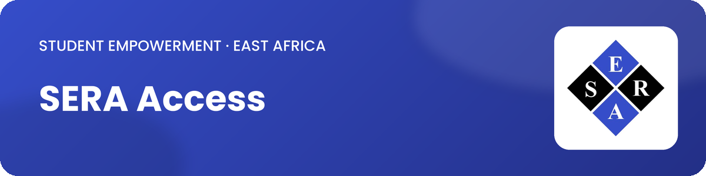
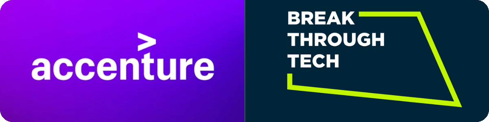
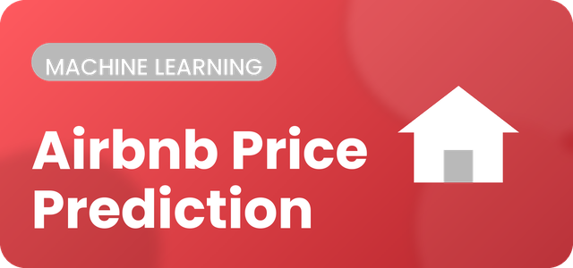
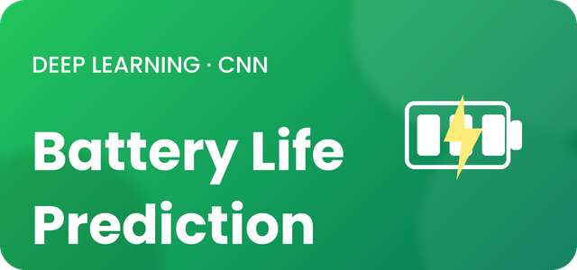
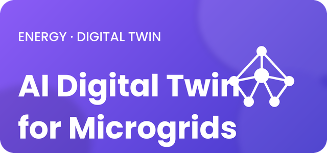
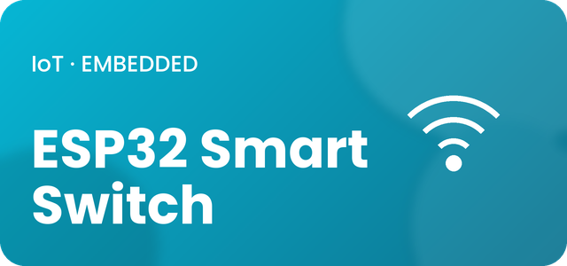
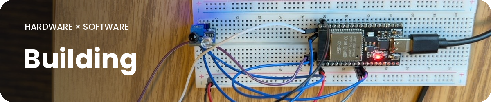
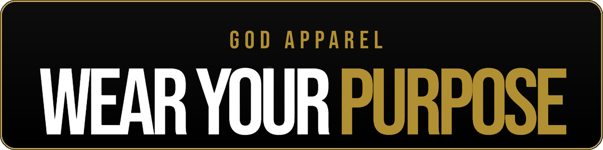

<h1 align="center">Hi, I'm Johnson Jasson 👋</h1>

  
  
  
  
    

---

### 🚀 ABOUT ME

I'm an **Electrical & Electronics Engineering and Mathematics** double major (4.00 GPA, Presidential Scholar) at **Alfred University**, training in **AI/ML at Cornell Tech** through Break Through Tech Program. 
I am passionate in _Technology_, _Data_, _AI_, _Semiconductors_ and _Business/ entrepreneurship_. 

### 🛠️ TECH STACK & TOOLS

**Languages**

  
  
  
  
  
  

**AI / ML & Data**

  
  
  
  
  

**AI-Assisted Development**

  
  
  
  
  
  

**Hardware & Engineering**

  
  
  
  
  
  

**Productivity & Design**

  
  
  
  

---
### 🏅 PROGRAMS & FELLOWSHIPS

### 🔨 Featured Projects

<table>
<tr>
<td width="100%" valign="top">

### 🎓 <a href="https://www.seraaccess.com">SERA Access</a> ↗
Co-founded & architected a student empowerment platform centralizing university applications for East Africa — a Common App–style system for Tanzania.

  

</td>
</tr>
</table>

<table>
<tr>
<td width="100%" valign="top">

### 🤖 AI Studio Fellow · Break Through Tech × Accenture
AI Fall Studio Fellow building predictive models on real consulting data — training and tuning ML models to forecast outcomes from client datasets.

   

</td>
</tr>
</table>

<table>
<tr>
<td width="50%" valign="top">

### 🏠 Airbnb Price Prediction
ML pipeline on 28,022 NYC listings (51 features) predicting price category; tuned via ROC-AUC, Precision & Recall.

  

</td>
<td width="50%" valign="top">

### 🔋 Battery Life Prediction
Benchmarked 14 ML models; CNN achieved lowest error (RMSE 0.085) for battery State-of-Health forecasting.

  

</td>
</tr>
<tr>
<td width="50%" valign="top">

### ⚡ AI Digital Twin for Microgrids
Self-learning BMS digital twin improving battery efficiency by 30% for renewable microgrids.

 

</td>
<td width="50%" valign="top">

### 📡 ESP32 Wi-Fi Smart Switch
IoT smart switch with remote ON/OFF control; C++ OOP firmware hosting an HTTP server for real-time GPIO control.

  

</td>
</tr>
</table>

---

### 🤝 LEADERSHIP

- **Co-President** – NSBE Chapter, Alfred University · 
- **Vice President** – ColorStack Chapter · 
- **Co-Founder** – SERA Access · 
- **Equity Research Analyst** – SMIF (Students Management and Investment Fund, valued at more than $1.1 million)
- **Break Through Tech Fellow** - Cornell University Tech Program.

---
### 📸 Hobbies

- **Volleyball** : Beach volleyball is nice, but I don't block smashes.
  
- **Photography** : I'm photoholic, and yes, I'm good at taking them. 
  
  
- **Building** : I love integrating theoretical knowledge into something visible and practical, both hardware and software.

- **Traveling**: this is what eats my money but I love it.

- **Designing**: I'm currently designing my apparel brand.

